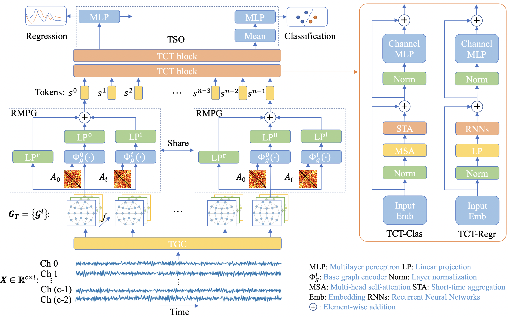
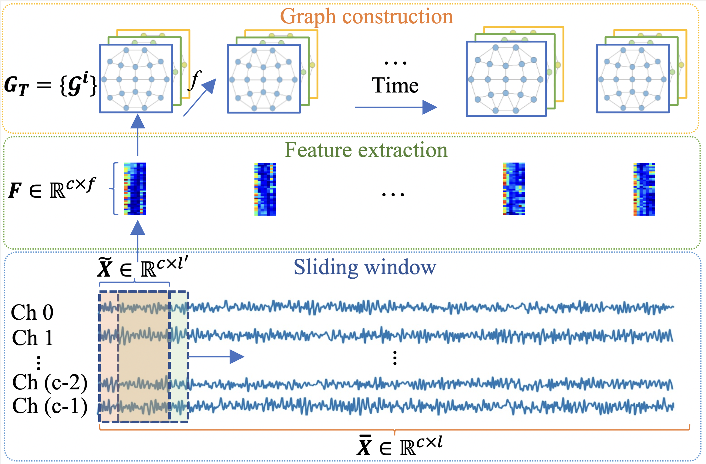

# EmT
This is the pytorch implementation of EmT, a graph-transformer for EEG emotion recognition, of our paper:

Yi Ding, Chengxuan Tong, Shuailei Zhang, Muyun Jiang, Yong Li, Kevin Lim Jun Liang, Cuntai Guan, "EmT: A Novel Transformer for Generalized Cross-subject EEG Emotion Recognition", in **IEEE Transactions on Neural Networks and Learning Systems (TNNLS), accepted** PDF available at [Arxiv](https://arxiv.org/abs/2406.18345).

# Network structure of EmT
<p align="center">

</p>

<p align="center">
 Fig.1 EmT structure
</p>
The network structure of EmT. The temporal graphs from TGC are used as the input to RMPG that will transfer each graph into one token embedding. Then TCT extract the temporal contextual information via specially designed token mixers. We propose two types of TCT structures, named TCT-Clas and TCT-Regr, for classification and regression tasks separately. A mean fusion is applied before feeding the learned embeddings into MLP head for the classification output. For regression tasks, a MLP head projects each embedding in the sequence into a scalar to generate a sequence that can be used to regress the temporally continuous labels.

# Temporal Graph Construction
<p align="center">

</p>

<p align="center">
 Fig.2 Illustration of TGC.
</p>
Each segment is split into several sub-segment. Features in different frequency bands are extracted for each sub-segment channel by channel. Then each EEG channel is regarded as a node, and the extracted features are treated as node attributes. Combing all the graphs which are in time order, we get the temporal graphs.

❗Please use the default parameters in each main script and change location parameters based on your own to run the code.

# CBCR License
| Permissions | Limitations | Conditions |
| :---         |     :---:      |          :---: |
| :white_check_mark: Modification   | :x: Commercial use   | :warning: License and copyright notice   |
| :white_check_mark: Distribution     |       |      |
| :white_check_mark: Private use     |        |      |

# Cite
Please cite our paper if you use our code in your work:

```
@ARTICLE{ding2024emtnoveltransformergeneralized,
      title={{EmT}: A Novel Transformer for Generalized Cross-subject {EEG} Emotion Recognition}, 
      author={Yi Ding and Chengxuan Tong and Shuailei Zhang and Muyun Jiang and Yong Li and Kevin Lim Jun Liang and Cuntai Guan},
      year={2024},
      eprint={2406.18345},
      archivePrefix={arXiv},
      primaryClass={cs.LG},
      url={https://arxiv.org/abs/2406.18345}}
```
